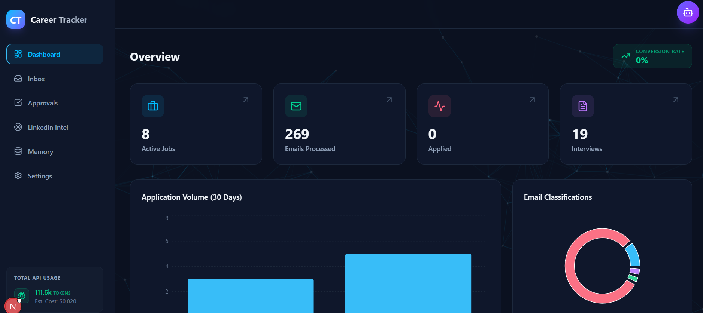
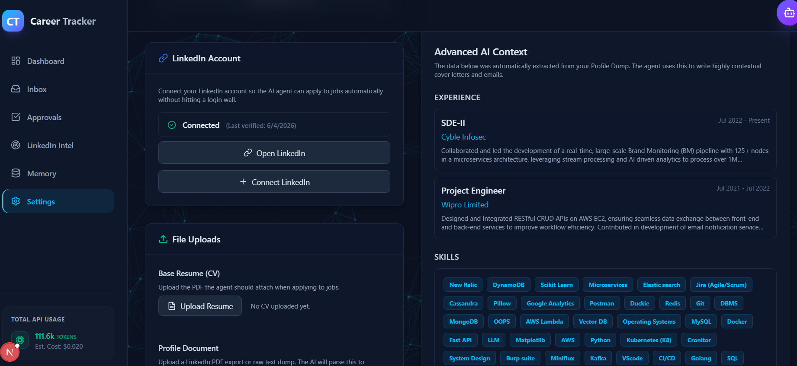
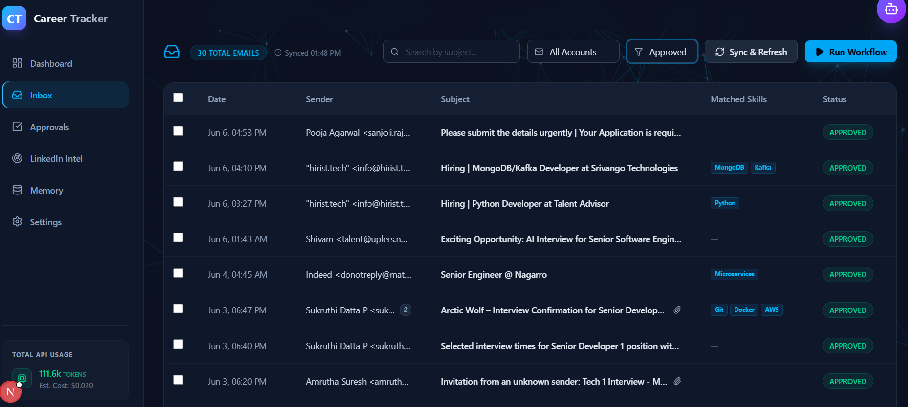
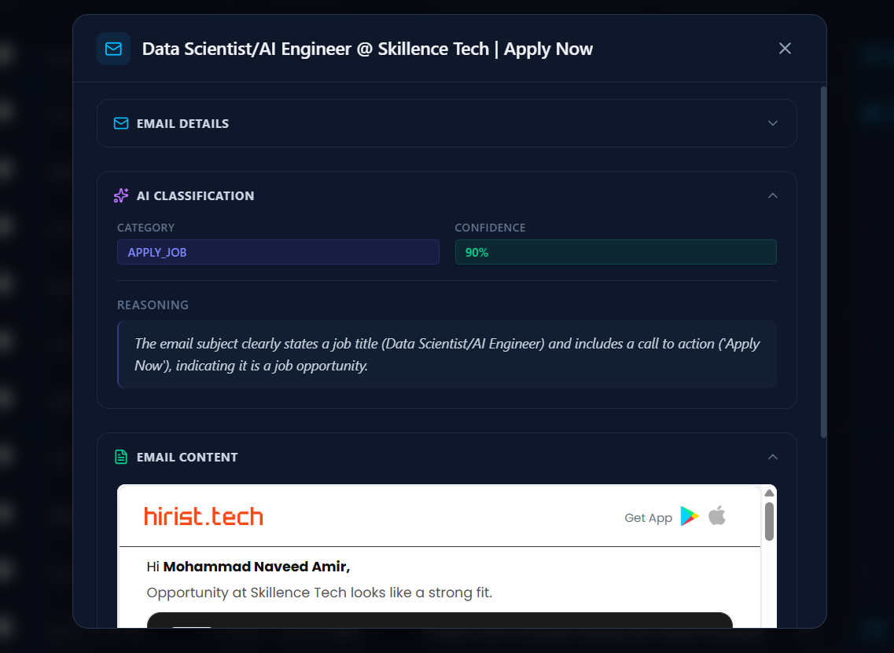
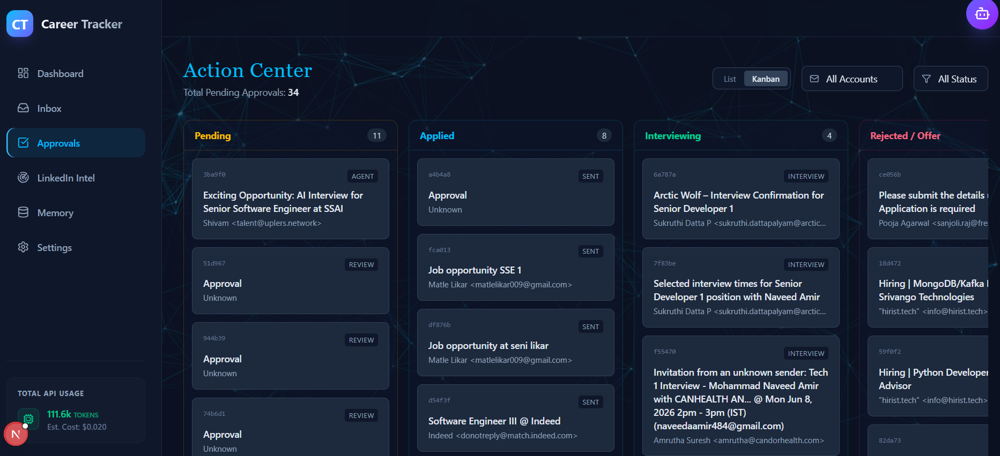
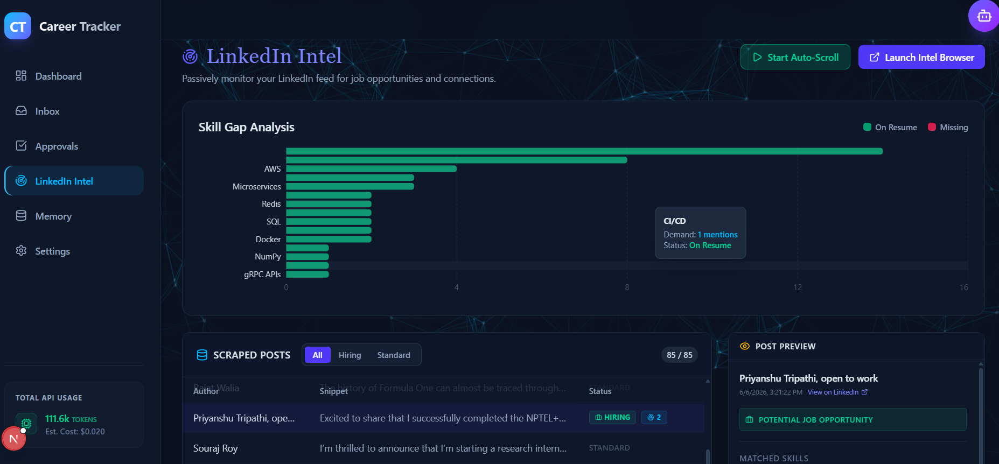
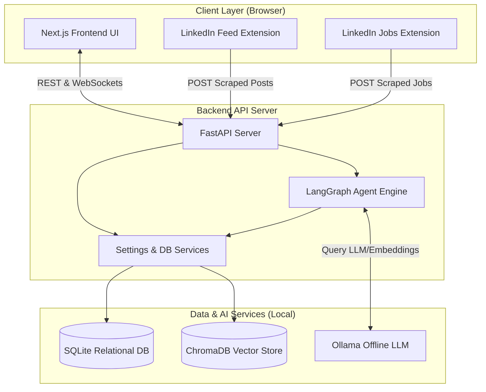

# 🎯 Career Tracker

**Local-first, Privacy-Preserving AI Job Application Assistant & Intelligence Dashboard**

Career Tracker is a local-first, AI-powered system designed to automate and simplify your job search. It monitors your Gmail inbox, classifies recruitment-related emails, extracts structured data, matches your skills against market intelligence gathered directly from LinkedIn, and visualizes your networking memory as an immersive 3D Neural Graph.

**100% Private & Local.** All relational data is stored in a local SQLite database, and semantic memory is managed in a local ChromaDB vector store. No data ever leaves your machine.

---

## ✨ Features

- **🧠 Offline AI Agent** — Powered by LangGraph and run locally via **Ollama**, meaning your resume, outreach, and applications are analyzed entirely on your machine.
- **📄 CV Profile Parser** — Upload your resume/CV (PDF), and the system automatically extracts and saves your professional profile and skills.
- **📧 Smart Email Segregation** — Automatically identifies recruiter outreach, job alerts, and rejections in your Gmail inbox, drafting tailored replies for your review.
- **🚀 Agentic Browser Applications** — Autonomously navigates and applies to jobs for you using browser automation (Playwright), placing applications in the Kanban for review.
- **🌐 LinkedIn Feed & Jobs Scraper** — Custom Chrome Extensions collect hiring posts and job postings as you browse, piping them directly into your local database.
- **✅ Action Center (Approvals tabs)** — A beautiful tabbed dashboard separating your tasks:
  1. **Email Drafts** — Review and dispatch cold application/referral drafts.
  2. **Portal Applications** — Execute browser-based automated applications.
  3. **Interviews** — Monitor invitations and responses.
  4. **LinkedIn Jobs** — View scraped job opportunities, apply directly, or draft referral emails locally.
- **💬 Conversational Review Chatbot** — Interactive chat to refine LLM drafts. Type feedback to rewrite, or type `yes` to approve and send immediately.
- **📬 SMTP SSL Fallback** — Send approved emails directly using a Gmail **App Password**, completely bypassing complex Google OAuth setup if desired.
- **🌌 3D Neural Memory Graph** — An interactive, WebGL-powered 3D visualization showing connections between your skills, companies, and recruiter threads.

---

## 📸 Screenshots

| Main Dashboard | Settings & Configuration |
|:---:|:---:|
|  |  |

| Inbox Management | Email Preview Modal |
|:---:|:---:|
|  |  |

| Approvals Tabs | LinkedIn Intelligence |
|:---:|:---:|
|  |  |

---

## 🏗️ Architecture

The system operates entirely locally on your machine using a modern, multi-tier layout:



1. **FastAPI Backend (Python)**: Manages local SQLite/ChromaDB databases, runs LangGraph agent workflows, and exposes REST and WebSocket APIs.
2. **Next.js Frontend (React/Tailwind)**: A highly-polished dashboard for monitoring inbox, approvals, intelligence, and visual memory.
3. **Chrome Extensions**: unpacked browser extensions that scrape LinkedIn feed posts (`linkedin_intel_ext`) and job postings (`linkedin_jobs_ext`).


---

## 🚀 Step-by-Step Installation

### Prerequisites
* **Python 3.11+**
* **Node.js 18+** (with npm)
* **Docker Desktop** (to run local Ollama)
* **Google Chrome** (for Chrome Extensions and browser automation)

---

### Step 1: Clone the Repository & Configure Environment
1. Clone the repository to your machine.
2. Duplicate the `.env.example` file and rename it to `.env`:
   ```bash
   cp .env.example .env
   ```
3. Open the `.env` file and customize your settings. *Note: Keep your secrets safe. Do not commit `.env` to GitHub (it is already in `.gitignore`).*

Here is an example `.env` configuration using a local Ollama service:
```env
# Ollama Local Service Configuration
OLLAMA_BASE_URL=http://localhost:11434
OLLAMA_MODEL=llama3.2:3b
OLLAMA_EMBEDDING_MODEL=nomic-embed-text

# SQLite Database
SQLITE_DB_PATH=./data/career_tracker.db

# Gmail App Password (Bypasses Google OAuth setup for sending emails)
# Set up a 16-character password in Google Account -> Security -> 2-Step Verification -> App Passwords
GMAIL_EMAIL=your_name@gmail.com
GMAIL_APP_PASSWORD=xxxx xxxx xxxx xxxx

# LLM Client Configuration (Points to local Ollama API)
OPENAI_API_KEY=ollama
OPENAI_API_BASE=http://localhost:11434/v1
LLM_MODEL=llama3.2:3b

# Background Daemon Intervals
EMAIL_POLL_INTERVAL_SECONDS=300
UI_CACHE_TTL_SECONDS=60
```

---

### Step 2: Set Up Local LLM (Ollama)
We run Ollama inside a Docker container for ease of use.
1. Start **Docker Desktop**.
2. Run the Ollama container:
   ```bash
   docker run -d -v ollama:/root/.ollama -p 11434:11434 --name jobchecker_ollama ollama/ollama
   ```
3. Pull the required models locally:
   ```bash
   # Pull the LLM model
   docker exec -it jobchecker_ollama ollama pull llama3.2:3b
   
   # Pull the embedding model (used for semantic memory search)
   docker exec -it jobchecker_ollama ollama pull nomic-embed-text
   ```

---

### Step 3: Set Up and Run the Application

#### Option A: One-Click Boot (Windows)
Double-click the **`run.bat`** script in the project root. It will create a virtual environment, install python libraries, run `npm install`, and launch both backend and frontend servers automatically.

#### Option B: Manual Startup (macOS / Linux / WSL)

**1. Start Python Backend:**
```bash
# Create and activate virtual environment
python3 -m venv venv
source venv/bin/activate

# Install dependencies
pip install -r requirements.txt

# Run the FastAPI server
PYTHONPATH=. venv/bin/python3 api.py
```
*The backend server will run at `http://localhost:8000`.*

**2. Start Next.js Frontend:**
```bash
cd frontend

# Install Node modules
npm install

# Run dev server
npm run dev
```
*The frontend dashboard will run at `http://localhost:3000`.*

---

### Step 4: Install the Chrome Extensions
1. In Google Chrome, navigate to `chrome://extensions/`.
2. Toggle **Developer mode** (top-right corner).
3. Click **Load unpacked** (top-left corner).
4. Select the `linkedin_intel_ext/` folder to install the **LinkedIn Feed Collector**.
5. Select the `linkedin_jobs_ext/` folder to install the **LinkedIn Jobs Scraper**.

Now, when you browse LinkedIn, the extensions will parse hiring posts and job cards and automatically push them into your local dashboard feed.

---

## 🎯 How to Use the Connections

1. **Upload Resume:** Go to the **Settings** page, scroll to **My Profile**, and upload your CV (PDF). The skills will extract automatically.
2. **Collect Jobs:** Browse LinkedIn Jobs page with the unpacked extension active. Scraped cards will pipe into the **Intelligence** and **Approvals** databases.
3. **Manage Action Center:**
   - Go to **Approvals** tab -> **LinkedIn Jobs** tab.
   - View details. Click **Apply Directly** to open the LinkedIn job URL in a new tab.
   - Click **Draft Referral Email**. The backend utilizes the local **Ollama** model offline to write a tailormade outreach email, then **auto-redirects you to the Email Drafts tab**.
4. **Approve & Send:**
   - On the **Email Drafts** tab, click **Review & Approve**.
   - Review the draft with the chatbot. If satisfied, type `yes`. The email will immediately be dispatched via secure SMTP using your Gmail App Password.

---

## 🔒 Security & Secrets Prevention
* **Never commit your `.env` file** or `data/credentials.json` files to Git. They are ignored by default in `.gitignore`.
* This repository uses a generic setup. If you plan to fork/push to public repositories, review and delete any database files (`*.db` under the `data/` folder) which might contain personal application details.

---

## 📄 License
This project is licensed under the MIT License.
